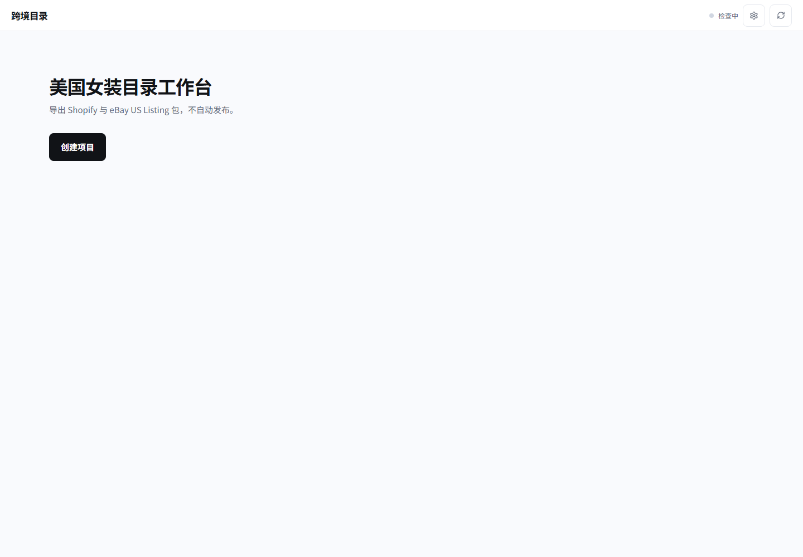
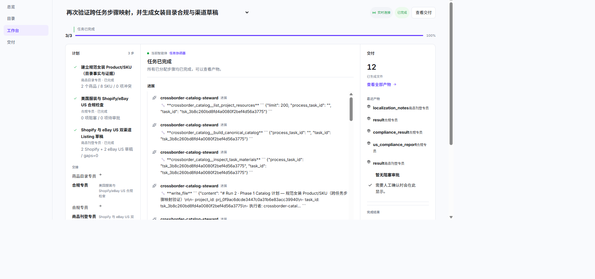
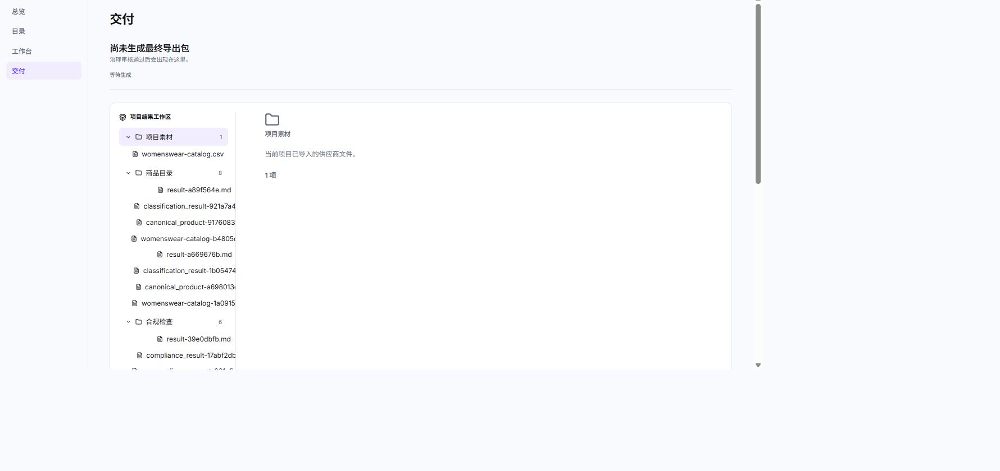

# 跨境商品目录协同工作台

面向多国家、多市场和多电商平台的跨境商品目录治理 Web 工作台。

它把供应商资料整理为规范的 Product/SKU，完成商品分类、目标市场合规、平台适配和治理审核，最后导出可交付的商品资料包。当前首发版本聚焦女装品类，支持美国市场、Shopify 和 eBay 美国站，只生成导入文件，不自动发布商品。

## 能力

- 导入 CSV、Excel、JSON、PDF、Markdown、文本和图片资料。
- 建立可追溯的商品与 SKU 事实，保留来源和证据。
- 根据目标市场和平台检查法规、政策与商品属性要求。
- 生成面向不同电商平台的本地化商品草稿。
- 支持人工审批、文件预览和最终 `listing_package.zip` 导出。
- 使用 AgentTeams 按目标动态选择需要的业务智能体，不强制执行固定流程。

## Web 预览

以下截图来自本地 Web 工作台的真实运行页面。







## 启动

环境要求：Python 3.11+、Node.js 20+、npm、Docker Desktop，以及已安装的官方 AgentTeams 服务。

安装项目依赖：

```powershell
python -m pip install -e ".[dev]"
cd web
npm install
```

启动 AgentTeams 和后端：

```powershell
.\scripts\start_agentteams.ps1
$env:PYTHONPATH = "src"
python -m crossborder_cowork.app
```

另开一个终端启动 Web：

```powershell
cd web
npm run dev
```

浏览器访问 `http://127.0.0.1:7777`。

## 使用

1. 创建项目。
2. 上传供应商资料，或主动导入示例数据。
3. 输入目标并选择需要的素材。
4. 在工作台查看 AgentTeams 的计划、智能体进展、审批和生成文件。
5. 在交付区预览并下载报告、平台草稿和最终导出包。

项目素材是可复用的输入；任务产物是带凭证的独立文件。只有通过治理审核后，系统才会生成最终导出包。

## 模型配置

可以在 Web 设置页配置模型，也可以使用环境变量：

```dotenv
LLM_MODEL_PLATFORM=openai
LLM_MODEL=your-model
LLM_API_KEY=your-key
LLM_BASE_URL=https://api.example.com/v1
```

## 运行边界

- Web 是第一版唯一界面，不包含 Electron 安装包。
- AgentTeams 负责协作、任务拆分和 Worker 调度；本项目负责业务数据、校验、审批、文件和 Web 展示。
- 当前版本落地美国市场、Shopify 和 eBay 美国站；后续通过市场规则、平台适配和技能包扩展更多国家与渠道。
- 当前版本不自动发布商品。

## 数据位置

运行数据默认保存在 `runtime/`：项目数据库、素材、任务产物、审批记录和文件凭证均在此目录中。
